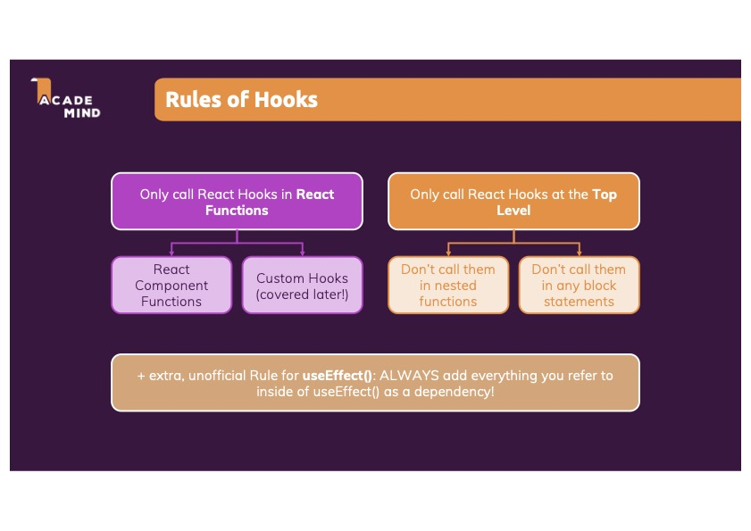
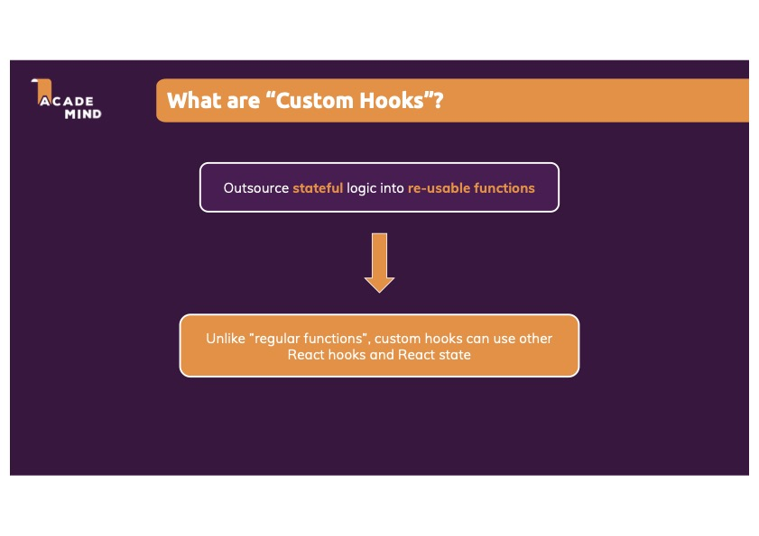
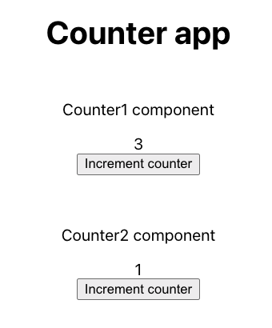
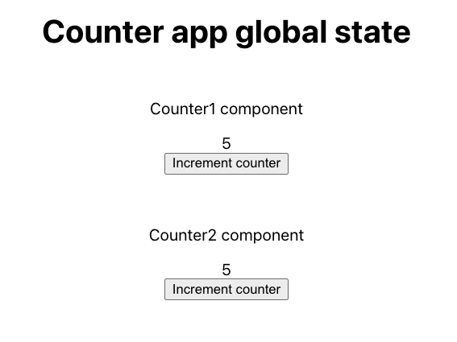

# Global state management with React hooks

Learn how to use React custom hooks 🪝to manage global state across the app **without** the need of  the`Context API` or libraries like Redux or MobX 🤯.

This is not a boring theory tutorial, it's a hands on one 💪, so we're gonna build this [demo app](https://replace-redux-with-custom-hook.web.app/) that uses a custom hook solution to manage global state and performs side effects (async tasks) when updating the state 🚀

This is the [gitHub repo](https://github.com/estebanmunchjones2019/replace-redux-with-custom-hook) with the code for:

- [master](https://github.com/estebanmunchjones2019/replace-redux-with-custom-hook) branch: custom hook solution without side effects
- [async](https://github.com/estebanmunchjones2019/replace-redux-with-custom-hook/tree/async) branch: custom hook solution with side effects

The content of this tutorial is based on this course: [React 16: The Complete Course (incl. React Router 4 &amp; Redux) | Udemy](https://www.udemy.com/course/react-the-complete-guide-incl-redux/?couponCode=D_0322)

👉 Big thanks to the reviewers:

- Gonzalo Aguirre [@_gonaguirre_](https://twitter.com/_gonaguirre), from Underscope ([Underscope - We deliver world-class mobile apps using React Native](https://underscope.io/)), a React Native company based in South America
- Fabiha Kathun

Table of contents:

**Intro**:

- [What is global state?](#what-is-global-state?)

- [Is Context API the solution to manage it?](#is-context-api-the-solution-to-manage-it?)
- [State management solution libraries](#state-management-solution-libraries)

**Get up to speed with hooks**:

- [What are hooks?](#what-are-hooks?)

- [Spotting duplicated code](spotting-duplicated-code)

- [First custom hook example](#first-custom-hook-example)
  
- [A more complex hook example](#a-more-complex-hook-example)
- [Scope of state in hooks](#scope-of-state-in-hooks)

**Building a global store**

- [Global state management requirements](global-state-management-requirements)
- [Global counter example](global-counter-example)
- [Final global state management solution](final-global-state-management-solution)
- [Final state management solution with side effects](final-state-management-solution-with-side-effects)

- [Pros and cons of the custom hook solution with side effects](pros-and-cons-of-the-custom-hook-solution-with-side-effects)

- [Conclusion](conclusion)

## What is global state?

In the React world the UI part of apps are made up of components, which are small units of code that render a view, and all of them are part of what is called a component tree.

Component tree chart here. ❌

What if we'd like to access some piece of data on different parts of the app? We'd be forced to keep state in a parent component that wraps the interested parts of the component tree.

Then, we could pass down the data via props to the interested parts, but that would lead to prop drilling. 

But hang on, what is prop drilling? Is when the same prop is passed through a long chain of components, making it repetitive and difficult to maintain.

Prop drilling chart here ❌

## Is Context API the solution to manage it?

There's a solution that is widely adopted in the React community to fix the propr drilling issue, and is the usage of the built in `Context API`, but it presents these 2 downsides:

- It's not meant and optimised for passing down high frequency changing data, like the `isFavourite` boolean property of a product item in an ecommerce app, but was meant for passing down more static things like `theme` variables, `login status`, `language`, and so on.
- After any of the data passed down via props through the Context API changes, all the components wrapped by the Provider that uses useContext will re-render, no matter if they use that specific piece of data or not. That could be patched by using the `useMemo` hook, but using that function is not for free, and will slow the performance of component tree re-rendering cycle and bloat your code.

When I say frequency, I mean a property changing at least twice in the lifecycle of the app. Usually, those changes are triggered by a user input, like the mentioned example of clicking a heart icon on the product card, to mark it is as favourite.

So, to anwser the question `Is Context API the solution?` It might not.

To sum it up, using Context is a way to avoid prop drilling, but it's still keeping state **inside** a React component, that is part of the **component tree**, and that way, the architecture is tied to that limitation of always choosing a parent component to hold that state.

If you'r interested in seeing the usage of the `Context API` and it's limitations, check out this great article: https://kentcdodds.com/blog/how-to-use-react-context-effectively.

## State management solution libraries

This issue of keeping state in React without hitting the problem of prop drilling, has been address initialy by the [Redux](https://redux.js.org/) library, by keeping state **outside components**.

Storing the state of the app outisde the component tree was the thing that made this library the go-to management solution for React, in other words, decoupling the app state and the UI components.

How does Redux work work? A store is created and then components can subscribe to changes to it, and dispatch actions that modify that state. Other libraries need to be added on top of Redux to perform asynchronous operations (or called side effects) before updating the state, like [Redux-Saga](https://redux-saga.js.org/) and [Redux-Thunk](https://github.com/reduxjs/redux-thunk).

There other state management solutions out there as well, like [Zustand]([Zustand Documentation](https://docs.pmnd.rs/zustand/introduction)), [Jotai](https://jotai.org/) , [Recoil](https://recoiljs.org/) (still in beta), [Rematch](https://rematchjs.org/) and [MobX]([README · MobX](https://mobx.js.org/README.html)).

To have an idea of the usage of the mentioned libraries, check out the chart here [@rematch/core vs jotai vs mobx vs react-redux vs recoil vs zustand | npm trends](https://www.npmtrends.com/@rematch/core-vs-jotai-vs-mobx-vs-react-redux-vs-recoil-vs-zustand)

Using libraries could be a great idea, but in this tutorial, you'll learn how to use the built in tools React offers to solve our problems, which are `hooks` in this case, so you can, at the end of the article, have a better knowlegde or React basics.

So, the plan for this tutorial is to use a **React custom hook** to

 👉 **keep state outside of components** 👈 and **manage global state** with them.

## What are hooks?

If you know about hooks, feel free to jump to section ❌

Hooks are **functions** that start with the name `use` and then the name of something else, like `State`, giving the full name  `useState`, as an example.

There are:

- **built in hooks**, like `useState`, and `useEffect`, `useCallback`, etc, that come already built in inside the React library code and we can import them from there.
  They help updating the state and do things when some `state` or `props` change on functional components, among other things.
  `useState`, and` useEffect` made the full switch from class based to functional components possible.
  
  You can have a look at hooks here: https://reactjs.org/docs/hooks-intro.html

- **Custom hooks** that we can use in components and other custom hooks, and they're helpful to move stateful logic/side effects outisde functional components so it can be re-used and at the same time, make the components leaner.

There are certain rules when using these hooks:


In the coming sections, we'll take a look at 2 custom hooks to understand them in depth, all with code examples and repos.

## Spotting duplicated code

What if we have two components, `Posts.js` and `Widget.js`, that need to show a list of posts from an API with different markup and amount of posts?

Post.js only displays the first 10 posts from the API.

```jsx
// src/Posts.js

import { useEffect, useState } from "react";
import React from 'react';

const Posts = props => {
    const [apiData, setApiData] = useState([]);

    useEffect(() => {
        const fetchData = async() =>{
          const rawData = await fetch("https://jsonplaceholder.typicode.com/posts");
          const data = await rawData.json();
          setApiData(data);
        }
        fetchData();
    // see if I get an error with empty dependancy array.
      // and if it works wihtout it.
    }, []);

  // then apiData is used in the template
  const posts = apiData.slice(0,9).map(item => {   
    return <li>{item.title}</li> <li>{item.body}</li>;
});
  return (
// React.fragments and title
    // add title here
      <ul>
          {posts}
      </ul>
  );
};

export default Posts;
```

And Widget.js displays just the first 3 posts from the list:

```jsx
// src/Widget.js

import { useEffect, useState } from "react";
import React from 'react';

const Widget = props => {
    const [apiData, setApiData] = useState([]);

    useEffect(() => {
        const fetchData = async() =>{
          const rawData = await fetch("https://jsonplaceholder.typicode.com/posts");
          const data = await rawData.json();
          setApiData(data);
        }
        fetchData();
    // see if I get an error with empty dependancy array.
      // and if it works wihtout it.
    }, []);

  // then apiData is used in the template to show only 3 posts
  const posts = apiData.slice(0,2).map(item => {   
    return <li>{item.title}</li>;
});
  return (
// React.fragments and title
    // change to <ol>
      <ul>
          {posts}
      </ul>
  );
};

export default Widget;
```

Note: array destructuring is used to assign variables `apiData` and `setApiData`, so if you'r not familiar with it, check out this [MDN Doc](https://developer.mozilla.org/en-US/docs/Web/JavaScript/Reference/Operators/Destructuring_assignment)

If we look at both components, we see a lot of duplication:

```jsx
// duplicated code
const [apiData, setApiData] = useState([]);

    useEffect(() => {
        const fetchData = async() =>{
          const rawData = await fetch("https://jsonplaceholder.typicode.com/posts");
          const data = await rawData.json();
          setApiData(data);
        }
        fetchData();
    // see if I get an error with empty dependancy array.
      // and if it works wihtout it.
    }, []);
```

 So **we need to outsource that repeated code into an function, outisde the components.**

The logic we need to abstract needs to call an API when the first render of `Posts.js` or `Widget.js` components happened, and then, when the asynchronous call to the API finished, the state of those component needs to get updated.

If we put all the logic into a normal function, like this:

```jsx
// WRONG APPROACH!!

export const duplicatedCode = () => {
const [apiData, setApiData] = useState([]);

    useEffect(() => {
        const fetchData = async() =>{
          const rawData = await fetch("https://jsonplaceholder.typicode.com/posts");
          const data = await rawData.json();
          setApiData(data);
        }
        fetchData();
    // see if I get an error with empty dependancy array.
      // and if it works wihtout it.
    }, []);

}
```

First, we would get an error saying: `error -here` ❌

The problem here is that the piece of logic we want to abstract contains built in hooks, like `useState` and `useEffec`, which are tied to the component lifecycle and state.

**The function has no way to know what's going on inside the components calling this hook (`Posts.js` and `Widget.js`)?** 

Even having those  `useEffect` and `useState` built in hooks inside that logic is not enough.

So, **the problem is the function needs to be more connected to what's going on inside the component.**

And that's what **custom hooks** solve! 🎉

Custom hooks can have any built in hooks inside it, like `useEffect` and `useState` (and also other custom hooks, like `useWhatever`) so every time the component that uses the hook re-renders, `useState` runs inside the the hook, and everytime we set up state inside the hook using `useState`, is the same as setting up state inside the component 🤯
👉 That's our connection problem solved! 👈

It can take you some time around to wrap your head around this idea 🥴, but over time it will become natural 😌.


## First custom hook example

Here is the custom hook called `usePosts` that will solve our code duplication problem:

```jsx
// src/hooks/usePosts.js

// import built in React hooks
import { useEffect, useState } from "react";

// this is the custom hook
const usePosts = () => {
  const [apiData, setApiData] = useState([]);

  useEffect(() => {
      const fetchData = async() =>{
        const rawData = await fetch("https://jsonplaceholder.typicode.com/posts");
        const data = await rawData.json();
        setApiData(data);
      }
      fetchData();
  }, []);

  return apiData;
}

export default usePosts;
```

Here is the code explained step by step:

1. We need to import the built in hooks `useEffect` and `useState` from the React library.

2. Then, we create a function (Yes! custom hooks are functions) BUT, we need to start its name with `use`.

3. We initialize the state as an empty arrayby typing: `const [apiData, setApiData] = useState([]);` and that's the same is initializing state inside the component `Posts.js` or `Widget.js`.

4. Once the component `Posts.js` or `Widget.js` has been rendered, the second time it re-renders, the `useEffect's` callback function is called again, and that's when the API is hit.
   
   As a side note, if we had another `useEffect` inside `Posts.js` for example, that function will be called **at the same time** as the `useEffect` inside `usePosts`.

5. We return the `apiData` array, as we wanna use it for displaying some posts in the UI. The good thing is that when the variable `apiData` is updated inside `usePosts` hook, that will trigger a re-render on `Posts.js` or `Widget.js` and the updated value of `usePosts` will be reflected on the template!

6. Then we export the hook, so we can call it inside components.

💡Useful notes about the `useEffect` dependacy array:

1. the `useEffect` dependancies array doesn't have `setApiData` added to it as it's a built in function of React that never changes (guaranteed by React), so it's the same pointer on re-renders

2. If you have functions as a dependancy, make sure you wrap them with `useCallback` so the they are the same object when the component re-renders, like this:

   ````jsx
   // useCallback approach
   
   const SomeComponent = () => {
   
     // when there are re-renders, someFunction will be the same JS pointer
   	const someFunction = 👉 useCallback(() => {
   		// function body here
   	},[]);
   	
   	useEffect(() => {
   		someFunction();
   		// some other code here
   	}, [👉someFunction])
   }
   ````

   ````jsx
   // workaround
   
   const SomeComponent = () => {
   	useEffect(() => {
   	 // we define the function inside the useEffect hook
   	  const someFunction(){
   	    // function body here
   		}
   		someFunction();
   		// some other code here
   	}, [])
   }
   ````
   

Now that our `usePosts` custom hook is ready, let's use it inside our components!

```jsx
// Posts.js

import React from 'react';
import usePosts from '../../usePosts-hook/usePosts';

const Posts = props => {
    const apiData = 👉 usePosts();
  const posts = apiData.slice(0,9).map(item => {   
    return <li>{item.title}</li> add body
});
  return (
      <ul>
// add title
          {posts}
      </ul>
  );
};

export default Posts;
```

```jsx
// Widget.js

import { useEffect, useState } from "react";
import React from 'react';

const Widget = props => {

 const apiData = 👉 usePosts();

  const posts = apiData.slice(0,2).map(item => {   
    return <li>{item.title}</li>;
});
  return (
// React.fragments and title
      <ul>
          {posts}
      </ul>
  );
};

export default Widget;
```

The component looks much leaner, and many other components can use that custom hook to query for data, that's great!

The only downside is that for every component using the custom hook, a new request to the API is made, but that can be fixed using the [final custom hook]()  One way to check for this it to check the `Network` tab, and we'll see as many `GET` requests to the API as many components using that hook are shown on the screen.

Another way to check how many times the fetch function was fired, is to add a `debugger`to the hook , like this:

```jsx
debbuger;
const rawData = await fetch("https://jsonplaceholder.typicode.com/posts");
```

and open the developer tools of your browser. We'll get the code stoped as many times as the number of components on the screen using that hook.


## A more complex hook example

There are more things hooks can do:

1. Get some arguments to configure it

2. Return objects, arrays, anything!

💡 Remember: hooks are functions, so they can take arguments and return any type of data

Let's image we have these two components, `App.js` and `NewTask.js` that connect to an API to read and create some tasks respectively:

```jsx
// App.js
// it fetches taks from the backend databse and displays them

import React, { useEffect, useState } from 'react';

import Tasks from './components/Tasks/Tasks';
import NewTask from './components/NewTask/NewTask';

function App() {
  const [isLoading, setIsLoading] = useState(false);
  const [error, setError] = useState(null);
  const [tasks, setTasks] = useState([]);

  const fetchTasks = async (taskText) => {
    setIsLoading(true);
    setError(null);
    try {
      const response = await fetch(
        'https://react-http-6b4a6.firebaseio.com/tasks.json'
      );

      if (!response.ok) {
        throw new Error('Request failed!');
      }

      const data = await response.json();

      const loadedTasks = [];

      for (const taskKey in data) {
        loadedTasks.push({ id: taskKey, text: data[taskKey].text });
      }

      setTasks(loadedTasks);
    } catch (err) {
      setError(err.message || 'Something went wrong!');
    }
    setIsLoading(false);
  };

  useEffect(() => {
    fetchTasks();
  }, []);

  const taskAddHandler = (task) => {
    setTasks((prevTasks) => prevTasks.concat(task));
  };

  return (
    <React.Fragment>
      <NewTask onAddTask={taskAddHandler} />
      <Tasks
        items={tasks}
        loading={isLoading}
        error={error}
        onFetch={fetchTasks}
      />
    </React.Fragment>
  );
}

export default App;
```

```jsx
// NewTask.js
// it adds new tasks to the database in the backend
// and updates the App's component state `tasks`

import { useState } from 'react';

import Section from '../UI/Section';
import TaskForm from './TaskForm';

const NewTask = (props) => {
  const [isLoading, setIsLoading] = useState(false);
  const [error, setError] = useState(null);

  const enterTaskHandler = async (taskText) => {
    setIsLoading(true);
    setError(null);
    try {
      const response = await fetch(
        'https://react-http-6b4a6.firebaseio.com/tasks.json',
        {
          method: 'POST',
          body: JSON.stringify({ text: taskText }),
          headers: {
            'Content-Type': 'application/json',
          },
        }
      );

      if (!response.ok) {
        throw new Error('Request failed!');
      }

      const data = await response.json();

      const generatedId = data.name; // firebase-specific => "name" contains generated id
      const createdTask = { id: generatedId, text: taskText };

      props.onAddTask(createdTask);
    } catch (err) {
      setError(err.message || 'Something went wrong!');
    }
    setIsLoading(false);
  };

  return (
    <Section>
      <TaskForm onEnterTask={enterTaskHandler} loading={isLoading} />
      {error && <p>{error}</p>}
    </Section>
  );
};

export default NewTask;
```

The code that's common to both components is:

```jsx
 setIsLoading(true);
    setError(null);
    try {
      const response = // GET || POST request here

      if (!response.ok) {
        throw new Error('Request failed!');
      }

      const data = await response.json();
      // do something with the data and update the app `tasks` state

    } catch (err) {
      setError(err.message || 'Something went wrong!');
    }
    setIsLoading(false);
```

The custom hook we can create to move this logic to looks like this:

```jsx
// use-http.js

import { useState, useCallback } from 'react';

const useHttp = () => {
  const [isLoading, setIsLoading] = useState(false);
  const [error, setError] = useState(null);

  const sendRequest = useCallback(async (requestConfig, applyData) => {
    setIsLoading(true);
    setError(null);
    try {
      const response = await fetch(requestConfig.url, {
        method: requestConfig.method ? requestConfig.method : 'GET',
        headers: requestConfig.headers ? requestConfig.headers : {},
        body: requestConfig.body ? JSON.stringify(requestConfig.body) : null,
      });

      if (!response.ok) {
        throw new Error('Request failed!');
      }

      const data = await response.json();
      applyData(data);
    } catch (err) {
      setError(err.message || 'Something went wrong!');
    }
    setIsLoading(false);
  }, []);

  return {
    isLoading,
    error,
    sendRequest,
  };
};

export default useHttp;
```

The hook is returning these an object in this case, with 3 keys:

1. `isLoading` of type `boolean`

2. `error` of type `string` or `null`;

3. `sendRequest`, a function that calls the api, that can be called inside the component whenever it's suits it. The function takes two arguments:
   
   a. `requestConfig`, that configures the http call with the appropiate `url`, `method`, `headers` and `body`.
   
   b. A callback function called `applyData`, that can update the UI by changing the state of the app.

You might notice the `useCallback` built in hook here:

```jsx
 const sendRequest = useCallback(//more code here)
```

That is done to make sure the `sendRequest` functions is the same object on every component re-render,and that way just make the useEffect callback function run just once (like when using the good old `ComponentDidMount()` method in class based components).

```jsx
useEffect(() => {
   sendRequest
  }, [sendRequest]);
```

The above useCallback usage is done in case we wanna comply with the dependancy array standards (we could leave it empty, and it would work as well).

Here is how the components use this hook:

```jsx
// App.js

import React, { useEffect, useState } from 'react';

import Tasks from './components/Tasks/Tasks';
import NewTask from './components/NewTask/NewTask';
import useHttp from './hooks/use-http';

function App() {
  const [tasks, setTasks] = useState([]);

   👉 const { isLoading, error, sendRequest: fetchTasks } = useHttp();

  useEffect(() => {
    const transformTasks = (tasksObj) => {
      const loadedTasks = [];
	    // massage the API data
      for (const taskKey in tasksObj) {
        loadedTasks.push({ id: taskKey, text: tasksObj[taskKey].text });
      }
      // change state to reflect changes in the UI
      setTasks(loadedTasks);
    };

    fetchTasks(
      { url: 'https://react-http-6b4a6.firebaseio.com/tasks.json' },
      transformTasks
    );
  }, [fetchTasks]);

  const taskAddHandler = (task) => {
    setTasks((prevTasks) => prevTasks.concat(task));
  };

  return (
    <React.Fragment>
      <NewTask onAddTask={taskAddHandler} />
      <Tasks
        items={tasks}
        loading={isLoading}
        error={error}
        onFetch={fetchTasks}
      />
    </React.Fragment>
  );
}

export default App;
```

Side note: `const { isLoading, error, sendRequest: fetchTasks } = useHttp();` means that `sendRequest` is being renamed to `fetchTasks`.

```jsx
// NewTask.js

import Section from '../UI/Section';
import TaskForm from './TaskForm';
import useHttp from '../../hooks/use-http';

const NewTask = (props) => {
  👉 const { isLoading, error, sendRequest: sendTaskRequest } = useHttp();

  const createTask = (taskText, taskData) => {
    const generatedId = taskData.name; // firebase-specific => "name" contains generated id
    const createdTask = { id: generatedId, text: taskText };

    props.onAddTask(createdTask);
  };

  const enterTaskHandler = async (taskText) => {
    sendTaskRequest(
      {
        url: 'https://react-http-6b4a6.firebaseio.com/tasks.json',
        method: 'POST',
        headers: {
          'Content-Type': 'application/json',
        },
        body: { text: taskText },
      },
      createTask.bind(null, taskText)
    );
  };

  return (
    <Section>
      <TaskForm onEnterTask={enterTaskHandler} loading={isLoading} />
      {error && <p>{error}</p>}
    </Section>
  );
};

export default NewTask;
```

There's a tricky part here:

```jsx
 // NewTask.js
 // What a heck is this? 🤔
 const enterTaskHandler = async (taskText) => {
     ...
     createTask.bind(null, taskText);👈❓
     ...
 } 
```

Well, our `applyData` callback function expects only one argument `data`:

```jsx
// use-http.js

const sendRequest = useCallback(async (requestConfig, applyData) => {
    ...
    applyData(data); 👈 //expects just one argument
    ...
}
```

and the function `createTask` we pass as `applyData` takes two arguments `taskText` and  `taskData`

```jsx
// NewTask.js

const createTask = (taskText, taskData) => { 👈 // expects 2 arguments
    props.onAddTask(createdTask);
  };
```

So we've got a problem: how we can possibly pass an extra argument `taskText` to `applyData`??

The `.bind` method lets us pre-configure (not execute) the function, so it takes the extra parameter `taskText` we need.

From [Function.prototype.bind() - JavaScript | MDN](https://developer.mozilla.org/en-US/docs/Web/JavaScript/Reference/Global_objects/Function/bind):
*The **`bind()`** method creates a new function that, when called, has its `this` keyword set to the provided value, with a given sequence of arguments preceding any provided when the new function is called.*

*The `bind()` function creates a new **bound function**, which is an *exotic function object* (a term from ECMAScript 2015) that wraps the original function object. Calling the bound function generally results in the execution of its wrapped function.

```jsx
createTask.bind(null, taskText)
```

The first argument is the context, which is `null`, beause we don't wanna change it, and the first argument is `taskText` which will be the extra argument.

To avoid the usage of this `bind()` method, the other option could be defining `createTask` inside `enterTaskHandler`, like this:

```jsx
// NewTask.js
import Section from '../UI/Section';
import TaskForm from './TaskForm';
import useHttp from '../../hooks/use-http';

const NewTask = (props) => {

 const { isLoading, error, sendRequest: sendTaskRequest } = useHttp();

 const enterTaskHandler = async (taskText) => {
👉 const createTask = (taskData) => {
    // taskText is defined in the scope of enterTaskHandler
    // I can safely use it.
    const generatedId = taskData.name; // firebase-specific => "name" contains generated id
    const createdTask = { id: generatedId, text: taskText };

    props.onAddTask(createdTask);
  };
    sendTaskRequest(
      {
        url: 'https://react-http-6b4a6.firebaseio.com/tasks.json',
        method: 'POST',
        headers: {
          'Content-Type': 'application/json',
        },
        body: { text: taskText },
      },
      👉 createTask // this a function pointer
    );
  };
return //some 
JSX here
```

If you've read to this point, congratulations! You have now a solid 💪 foundational knowledge of how hooks 🪝work, so let's move on the next section, where we'll explore what happens with state inside hooks.

There is an important question here:

👉 Is the state inside hooks shared between the components that use it ❓❓❓🤔

Let's find out! 🤓

## Scope of state in hooks

Sometimes, we want to have state that can be read and also changed from different parts of the app. To see how hooks manage their state, let's build a simple app ([repo link here](https://github.com/estebanmunchjones2019/counter-app)) that displays two counters and 2 buttons to increase it.

````jsx
// src/hooks/useCounter.js

import { useState } from 'react';

const useCounter = (componentName) => {

    // let's log the component that is calling this hook
    console.log('useCounter hook function running because' + componentName + ' is calling it');

    // all components using the hooks will have counter with value 0 as initial state
    const [counter, setCounter] = useState(0);

    return [counter,setCounter];
}

export default useCounter;
````


```jsx
// src/App.js

import Counter1 from './components/Counter1';
import Counter2 from './components/Counter2';

function App() {
  return (
    <div className="App">
      <header>
        <h1>Counter app</h1>
      </header>
      <body>
        <p>Counter1 component</p>
        <Counter1/>
        <p>Counter2 component</p>
        <Counter2/>
      </body>
    </div>
  );
}

export default App;
```

```jsx
// src/Counter1.js

import useCounter from "../hooks/useCounter";

function Counter1() {
    const [counter, setCounter] = useCounter('Counter1');
    return (
        <>
            <div>{counter}</div>
            <button onClick={() => setCounter(counter + 1)}>
                Increment counter
            </button>
        </>
    );
}

export default Counter1;
```

```jsx
// src/Counter2.js

import useCounter from "../hooks/useCounter";

function Counter2() {
    const [counter, setCounter] = useCounter('Counter2');
    return (
        <>
            <div>{counter}</div>
            <button onClick={() => setCounter(counter + 1)}>
                Increment counter
            </button>
        </>
    );
}

export default Counter2;
```


If both components are using the same function `useCounter`, we would expect the `counter` state to be the same for both components, and when clicking any of the 2 buttons, we would see both counters to increment the values by one at the same time, but...

No!😯  the state is not shared, because each counter has different values 🤔



When calling the built in `useState` or `useReducer` inside custom hooks, the state stored "inside the hook" is **different** for every component calling that hook, in other words, **scoped to the component** using it.

That isn't very helpful if we want to have a global state, isn't it? 🤔

## Global state management requirements

We have now finished understanding how hooks work, including how state is individual for each component using a custom hook.

Let's first think about what things the global state management solution should do for us:

1) Provide the same state to components and pass them a function to update it.

2) When one components updates the state, the rest of the interested components should get the updated value.

To overcome this issue of hooks having different states for each component using the hook, we need something that remains the same every time the hook is being called by components. An variable declared outisde the hook with the `let` keyword looks  like a really good candidate! 

## Global counter example

Let's try to create a global counter ([repo link here](https://github.com/estebanmunchjones2019/counter-app-global-state)) that any component on the app can update and read the most updated value 🤯

The structure of the hook should be something like this

````jsx
// object pointer usage

// globalStore variable should be a pointer of an emtpy object
let globalCounter = {}

// let's name the custom hook useStore
const useCounterStore = () = {
  // we can use the globalStore variable + useState hooks to share
  // the same state across components!
}
````

Having a variable defined outside the hook, that can be updated, is the first part of the puzzle solved. 

The next step is to find a way to notify of the variable value changes to all the components that are using the hook and are displayed on the screen. This part is becoming tricky...🤔

In other words, if we have component A and B using the `useStore` custom hook, when component A changes the state (mutating the variable), component B should be notified that the state changed, and then be passed the new value.

Let's jump directly to the solution and then discuss how it works:
````js
// src/useCounterStore.js

import { useState, useEffect } from 'react';

// hardcoded value for the initial state
let globalCounter = 0;

// let's store the functions to update state for each interested component
// this is an array of setCounter function pointers.
let listeners = [];

const useCounterStore = () => {

    // we're not interested in using the counter state, just setCounter
    const setCounter = useState(globalCounter)[1];

    // let's create a function that updates the global counter
    const incrementCounter = () => {
        // let's change the variable globalCounter defined outside the hook
        globalCounter = globalCounter + 1;

        // let's call the function setCounter corresponding to each interested component
        // so they re-render, and show the latest globalCounter value
        for (const listener of listeners) {
            listener(globalCounter);
        }
        
    }

    // let's register the components when they call this hook for the first time by
    // pushing their corresponding setCounter function into the listeners array
  useEffect(() => {
    //when the component did mount, its corresponding setCounter function is added to the list, as a pointer, like all functions
    listeners.push(setCounter);

    //There's an unmounting clean up function (which is a closure), that de-registers the component from the listeners
    return () => {
      listeners = listeners.filter(li => li !== setCounter);
    };
  }, [setCounter]);


  // let's return the global state and a way to update it
  return [globalCounter, incrementCounter]

   
}

export default useCounterStore;
````

```jsx
// src/Counter1.js

import useCounterStore from "../hooks/useCounterStore";

function Counter1() {
    const [globalCounter, incrementCounter] = useCounterStore();
    return (
        <>
            <div>{globalCounter}</div>
            <button onClick={incrementCounter}>
                Increment counter
            </button>
        </>
    );
}

export default Counter1;
```

Some notes about the code:

- Components that use counterGlobal won't be re-rendered just for the fact that variable changes, but because we'll trigger a setCounter inside each interested component. 

- Register the interested components: the first time an interested component calls the hook (when being mounted to the Virtual DOM), we need to add the `setCounter` function pointer to an array, called `listeners`. Each setCounter pointer is linked to the component that called the hook. That way, every time we call the useState functions referenced in the array, every component will re-render, and that way, they will be able to display the updated value of the global variable `globalCounter`.

- An important note about the `listeners` array. is that the first `setCounter` function there corresponds the most parent component in the app that uses that hook, then we have the children's functions, grandchildren, and so on. That way, we ensure that when there's a change of state, the first to component to know about it is the most parent component, and not the children. If we hadn't this specific order in `listeners` we could have this error on the console:
  ```
   Warning: Cannot update a component (`ProductItem`) while rendering a different component (`ProductItem`). To locate the bad setState() call inside `ProductItem`, follow the stack trace as described in https://fb.me/setstate-in-render
      in ProductItem (at Products.js:15)
      in ul (at Products.js:13)
      in Products (created by Context.Consumer)
      in Route (at App.js:13)
      in main (at App.js:12)
      in App (at src/index.js:14)
      in Router (created by BrowserRouter)
      in BrowserRouter (at src/index.js:13)
  
      the difference with using state is that dispatch function wasn't triggering a re-render of this component first
      because we were calling the setStates as they were stored in the list (from parents to children).
  ```

- Clean up function: that anonymous functions is a closure. What does that mean? setCounter function is kind of trapped inside the outer anonymous function, and can be referenced  in the clean up function if we hadn't a closure, it would be hard to know which setCounter to remove from the list, because that useEffect function is being called by multiple components.

- `setCounter` is passed to the `useEffect` dependancy array because it's an external dependancy, and in this case, it's not gonna change every time the hooks runs, because it's a built in React function that is guaranteed by React to stay the same (be the same pointer). 

- 💡Remember, changes in props and state (only through calls to a setState function, called setCounter in this example) will trigger re-render in components.

  

The state is global now!




## Final global state management solution

The solution to manage a global `count` state is really good, but what if we could have a custom hook that can be used to manage any kind of state, not only `counter` state, that uses a Redux-like approach?

The Redux approach is explained in detail on [this documentation](https://redux.js.org/tutorials/fundamentals/part-2-concepts-data-flow).

There are two main concepts in Redux land: `actions` and `reducers`.

Actions are objects with a `type` and a `payload`, that are dispatched (or fired) when certain things happen in the app (e.g add button clicked to add `Buy Milk` text to a list item) :

```
// Action example:

const addTodoAction = {
  type: 'todos/todoAdded',
  payload: 'Buy milk'
}
```

A **reducer** is a function that receives the current `state` and an `action` object, decides how to update the state if necessary, and returns the new state: `(state, action) => newState`. **You can think of a reducer as an event listener which handles events based on the received action (event) type.**

````javascript
// Reducer example

const initialState = { todoList: [] }

function counterReducer(state = initialState, action) {

  // Check to see if the reducer cares about this action
  // switch statements are commonly used instead of `if` checks
  if (action.type === 'todos/todoAdded') {
    // If so, make a copy of `state`
    return {
    // clone the state
      ...state,
     // clone the array + push the new item
      todoList: [...todoList, action.payload]
    }
  }
  // some more if checks here...
  // otherwise return the existing state unchanged
  return state
}
````

Without further a do, let's jump into the custom hook solution to manage global state like Redux 🚀

````js
// /hooks-store/store.js

import { useState, useEffect } from 'react';

let globalState = {};

let listeners = [];

let actions = {};

👇
export const useStore = () => {
  const setState = useState(globalState)[1];

  const dispatch = (actionIdentifier, payload) => {
    const newState = actions[actionIdentifier](globalState, payload);
    globalState = { ...globalState, ...newState };

    for (const listener of listeners) {
      listener(globalState);
    }
  };

  useEffect(() => {
    listeners.push(setState);

    return () => {
      listeners = listeners.filter(li => li !== setState);
    };
  }, [setState]);

  return [globalState, dispatch];
};

👇
export const initStore = (userActions, initialState) => {
  if (initialState) {
    globalState = { ...globalState, ...initialState };
  }
  actions = { ...actions, ...userActions };
};
````

Two functions are exported above:

- `useStore`: this useStore hook will be called in the the files of the interested components
- `initStore`: called in special JS files (e.g pwhere the initial state for each state slice and actions are set up from individual so the state con hold multiple slices of data e.g: globalState= { products: someData, orders: someData}  and so on.

````javascript
// /hooks-store/products-store.js

👇
import { initStore } from './store';

const configureStore = () => {
  const actions = {
    TOGGLE_FAV: (curState, productId) => {
      const prodIndex = curState.products.findIndex(p => p.id === productId);
      const newFavStatus = !curState.products[prodIndex].isFavorite;
      const updatedProducts = [...curState.products];
      updatedProducts[prodIndex] = {
        ...curState.products[prodIndex],
        isFavorite: newFavStatus
      };
      return { products: updatedProducts };
    }
  };
  
  👇
  initStore(actions, {
    products: [
      {
        id: 'p1',
        title: 'Red Scarf',
        description: 'A pretty red scarf.',
        isFavorite: false
      },
      {
        id: 'p2',
        title: 'Blue T-Shirt',
        description: 'A pretty blue t-shirt.',
        isFavorite: false
      },
      {
        id: 'p3',
        title: 'Green Trousers',
        description: 'A pair of lightly green trousers.',
        isFavorite: false
      },
      {
        id: 'p4',
        title: 'Orange Hat',
        description: 'Street style! An orange hat.',
        isFavorite: false
      }
    ]
  });
};

👇
export default configureStore;
````

Some notes of the above code:

- the `actions` `object` is just an object with keys that are the identifiers, and then, the key value is a function that takes state and a payload, and returns the new state. It's a **hybrid of a Redux action and reducer**

- The `initStore` function is called when the `configureStore` function is called in another JS file (e.g `index.js`, and that will change add the actions and initial state of the `products` slice.

  

Let's see where `configureStore` is called:

````js
// index.js

import React from 'react';
import ReactDOM from 'react-dom';
import { BrowserRouter } from 'react-router-dom';

import './index.css';
import App from './App';

👇
import configureProductsStore from './hooks-store/products-store';

👇
configureProductsStore();

ReactDOM.render(
  <BrowserRouter>
    <App />
  </BrowserRouter>,
  document.getElementById('root')
);

````

Some notes:

- In `Index.js` we can configure other slices of the store, like `orders` , `payments` etc, by first setting up config files like `/hooks-store/products-store.js` but named differently, like `/hooks-store/orders-store.js`, and then calling them here, e.g `configureOrdersStore`, etc.

The `useStore` hook can be used inside components to read and update the data slices:

````js
// /containers/products.js

import ProductItem from '../components/Products/ProductItem';
import { useStore } from '../hooks-store/store';
import './Products.css';

const Products = props => {
  
  // we're just interested in reading the state, not dispatching and action
  👇
  const state = useStore()[0];
  return (
    <ul className="products-list">
        👇
      {state.products.map(prod => (
        <ProductItem
          key={prod.id}
          id={prod.id}
          title={prod.title}
          description={prod.description}
          isFav={prod.isFavorite}
        />
      ))}
    </ul>
  );
};

export default Products;

````

````js
import React from 'react';

import Card from '../UI/Card';
import { useStore } from '../../hooks-store/store';
import './ProductItem.css';

const ProductItem = props => {

  // we're just interested in dispatching and action, not in reading the state 
  👇
  const dispatch = useStore()[1];

  const toggleFavHandler = () => {
    // toggleFav(props.id);
    👇
    dispatch('TOGGLE_FAV', props.id);
  };

  return (
    <Card style={{ marginBottom: '1rem' }}>
      <div className="product-item">
        <h2 className={props.isFav ? 'is-fav' : ''}>{props.title}</h2>
        <p>{props.description}</p>
        <button
          className={!props.isFav ? 'button-outline' : ''}
          onClick={toggleFavHandler}
        >
          {props.isFav ? 'Un-Favorite' : 'Favorite'}
        </button>
      </div>
    </Card>
  );
};

export default ProductItem;

````


## Final state management solution with side effects

So far, so good. Our custom hook solution works like a charm, but what if we want to perform async tasks before/after updating the state?

That async task could be a GET or POST request, and depending on the result, dispatch or not action, or just dispatching an action with fresh data from that API.

For this solution, let's make use of the async await features, that make the JavaScript code so nice to read.

Heads up! If you'r gonna use the following snippets in production code, make sure you test it thoroughly, because it's an experimental hook 🧪.

If you find the next pieces of code buggy, please submit a PR so we can improve it! 🚀

````javascript
// /src/hooks-store/store.js

import { useState, useEffect } from 'react';

let globalState = {};

let listeners = [];

let actions = {};
👇
let sideEffects = {};

export const useStore = () => {
  const setState = useState(globalState)[1];

  const dispatch = 👉 async (actionIdentifier, payload) => {
    👇
    if (sideEffects[actionIdentifier]) {
      await sideEffects[actionIdentifier](globalState, dispatch, payload);
    }
    👇
    const newState = actions[actionIdentifier] ? 
      actions[actionIdentifier](globalState, dispatch, payload) : 
   	  { ...globalState 				};
  
    globalState = { ...globalState, ...newState };

    console.log(`after running action: ${actionIdentifier} action for ${payload} product`,  'the updated globalState is: ', 				globalState );

    for (const listener of listeners) {
      listener(globalState)
    }
  };

  useEffect(() => {
    listeners.push(setState);

    return () => {
      listeners = listeners.filter(li => li !== setState);
    };
  }, [setState]);

  return [globalState, dispatch];
};

export const initStore = (userActions, 👉 userSideEffects, initialState) => {
  if (initialState) {
    globalState = { ...globalState, ...initialState };
  }
  actions = { ...actions, ...userActions };
  👇
  sideEffects = { ...sideEffects, ...userSideEffects}
};

````

````javascript
import { initStore } from './store';

👇
// fake async task that takes 4 seconds to resolve
const fakePostRequest = (payload) => {
  console.log(`Posting : ${payload.productId} to analytics as favouriteL ${payload.newFavStatus}`);
  // this fakes sending the value of productId & newFavStatus to an analytics service everytime the button is clicked
  return new Promise((resolve, reject) => {
    setTimeout(() => {
        console.log(`${payload.productId} successfully posted to analytics!`)
        resolve();
    }, 4000);
  });
}

const configureStore = () => {
  const actions = {
    TOGGLE_FAV: (curState, dispatch, productId) => {
      const prodIndex = curState.products.findIndex(p => p.id === productId);
      const newFavStatus = !curState.products[prodIndex].isFavorite;
      const updatedProducts = [...curState.products];
      updatedProducts[prodIndex] = {
        ...curState.products[prodIndex],
        isFavorite: newFavStatus
      };
			👇
      dispatch('POST_TO_ANALYTICS', { productId, newFavStatus });

      return { products: updatedProducts };
    },
    👇
    SET_TIMES_CLICKED: (curState, dispatch, productId) => {
      const prodIndex = curState.products.findIndex(p => p.id === productId);
      const updatedProducts = [...curState.products];
      updatedProducts[prodIndex] = {
        ...curState.products[prodIndex],
        timesClicked: curState.products[prodIndex].timesClicked + 1
      };

      return { products: updatedProducts };
    }
  };
	👇
  const sideEffects = {
   POST_TO_ANALYTICS: async (curState, dispatch, payload) => {
        console.log(`POST_TO_ANALYTICS sideEffect is running for product ${payload} `, 'globalState is: ', curState,'payload is :', payload);
        try {
          // fake call to post data to an Data analytics API
          // this is just an example, you might not do this in real life analytics
          await fakePostRequest(payload);
          dispatch('SET_TIMES_CLICKED', payload.productId);
        } catch(error) {
          // analytics post failed, let's not dispatch the action to mark it as clicked
          return;
        }
    }
  }

  initStore(actions, 👉 sideEffects, {
    products: [
      {
        id: 'p1',
        title: 'Red Scarf',
        description: 'A pretty red scarf.',
        isFavorite: false,
        👇
        timesClicked: 0
      },
      {
        id: 'p2',
        title: 'Blue T-Shirt',
        description: 'A pretty blue t-shirt.',
        isFavorite: false,
        timesClicked: 0
      },
      {
        id: 'p3',
        title: 'Green Trousers',
        description: 'A pair of lightly green trousers.',
        isFavorite: false,
        timesClicked: 0
      },
      {
        id: 'p4',
        title: 'Orange Hat',
        description: 'Street style! An orange hat.',
        isFavorite: false,
        timesClicked: 0
      }
    ],
  });
};

export default configureStore;
````

Some notes about this solution:

1. In `/src/hooks-store/store.js`:a

- An `if` check and a `ternary expression` have been added inside the `dispatch` function body, in case some `actions` or `sideEffect` functions are not defined for a specific `actionIdentifier`

2. In `/src/hooks-store/products-store.js`:

- `sideEffects` functions don't change state, they just run before actions,  they do async tasks (like posting data, geting data from endpoints, etc) and they then dispatch another action with some fresh data (if needed), or they could even not dispatch an action at all.
- `actions` functions can also dispatch other actions. This is a difference with how Redux 

The expected beahaviour when a user toggles the `Favourite` button is the following:

1.  The `Favourite` button is clicked

2.  `TOGGLE_FAV` action is dispatched

3.  The `isFavorite` boolean property of the product is toggled `true`.

4.  `POST_TO_ANALYTICS` action is dispatched, holding the new `isFavourite` boolean value.

5.  The button text changes to `Un-favorite`.

6.  The post request to analytics starts, with a request body holding the `productId` and  `isFavourite` values.

7.  After 4 seconds, the analytics server responds successfully.

8.  `SET_TIMES_CLICKED` action is displayed, just passing the `productId` as payload

9.  The property `timesClicked` of the product is incremented by 1.

So, to recap, the timesClicked propery is updated only if data has been successfuly posted to an analytics server.

Feel free to start smashing the `Favourite` buttons and check the log messages in the console log, it's really fun 🤓


## Pros and cons of the custom hook solution with side effects

### Advantages:

Reading at the [Redux documentation](https://redux.js.org/tutorials/fundamentals/part-2-concepts-data-flow), the proposed solution with custom hooks shares these advantages with Redux:

#### 1.  Single Source of Truth: 

"The **global state** of your application is stored as an object inside a single **store**. Any given piece of data should only exist in one location, rather than being duplicated in many places.

This makes it easier to debug and inspect your app's state as things change, as well as centralizing logic that needs to interact with the entire application."

That way, when any component dispatches an action, the state is changed, and then all the interested components are notified of the new state value, in a one way system."


2. #### State is Read-Only

"The **global state** of your application is stored as an object inside a single **store**. Any given piece of data should only exist in one location, rather than being duplicated in many places.

This makes it easier to debug and inspect your app's state as things change, as well as centralizing logic that needs to interact with the entire application."

And this is an **advantage** over Redux:

1. #### Lightweight

   There's no dependancy on a library, we'r just using built in React features.

2. #### Out of the box Async taks handling 

   Make API calls and other async taks out of the box, plus call dispatch more actions inside actions

### Disadvantages:

One disadvantage over Redux:

1. #### Debugging experience

   No Redux debugging tools through the [Redux Devtools extension]((https://chrome.google.com/webstore/detail/redux-devtools/lmhkpmbekcpmknklioeibfkpmmfibljd?hl=en))  can be used in the browser to debug state.

   


## Bonus

Do you remember the duplicate http calls to get the list of posts we had when using the `usePosts` hook? (in this [section](first-custom-hookexample) of the article)

We can now solve the problem by using the [useStore hook with side effects ](final-state-management-solution-with-side-effects)with the store configured like this:

````
````

And by calling `FETCH_POSTS` at a high level of the app, so all the components (even the most nested ones) using the `posts` have it available when they render (or they can get them as soon as the single http call response arrives).

❌ create a Posts app with 2 branches: one for the usePosts hook (2 fetch requests), and the other with the useStore hook (single request);

❌ create only one Counter app with 2 branches

## Conclusion

If you have reached this point, massive congrats!🎉

It's no enough to read blogposts to get good at React hooks and state management, you need to spend time on your keyboard building apps, so I encourage you to do that 🤓

And from now on, you can use this global state management solution in your side projects,  if you want to avoid using a state management solution libray or React Context.

💻Happy coding! 💻


